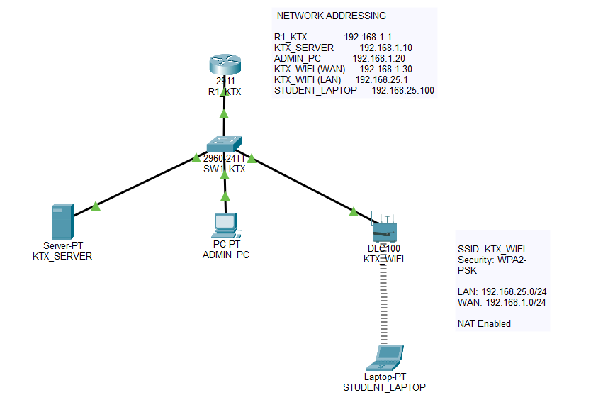

# 🚀 Smart Dormitory Access Control System - IoT Subsystem

## 📌 Giới thiệu

Đây là Repository dành riêng cho khối **IoT Subsystem** thuộc đồ án:

> **Hệ thống Kiểm soát Ra vào Ký túc xá Thông minh (Smart Dormitory Access Control System)**

Repository này được xây dựng nhằm phát triển độc lập các thành phần phần cứng, firmware và cơ chế giao tiếp giữa các thiết bị IoT với hệ thống Backend.

---

# 🎯 Mục tiêu

Xây dựng hệ thống kiểm soát ra vào thông minh cho Ký túc xá với các phương thức xác thực:

* RFID Authentication
* Face Recognition
* Fingerprint Authentication

và các tính năng:

* Remote Unlock
* Access Logging
* MQTT Communication
* Offline Cache
* Device Monitoring

---

# 🏗️ Kiến trúc hệ thống

```text
RFID / Face / Fingerprint
            ↓
          ESP32
            ↓
      MQTT Broker
            ↓
 Spring Boot Backend
            ↓
       PostgreSQL
```

### Điều khiển từ xa

```text
Admin Web / Mobile App
            ↓
     Spring Boot
            ↓
      MQTT Broker
            ↓
          ESP32
            ↓
          Relay
            ↓
     Electronic Lock
```

---

# 🧩 Thiết bị sử dụng

## Vi điều khiển

* ESP32

## Thiết bị xác thực

* MFRC522 RFID Reader
* Fingerprint Sensor
* Camera (Face Recognition)

## Thiết bị điều khiển

* Relay Module
* Electronic Lock

## Giao tiếp

* WiFi
* MQTT

---

# ⭐ Tính năng nâng cao

## 📴 Offline Cache

* Lưu danh sách RFID hợp lệ trên ESP32
* Cho phép mở cửa khi mất kết nối MQTT
* Đồng bộ Access Log khi hệ thống hoạt động trở lại

## 📡 Device Monitoring

* Heartbeat định kỳ
* Theo dõi Online / Offline
* Giám sát trạng thái thiết bị

---

# 📂 Cấu trúc Repository

```text
ktx-smart-access-iot
│
├── docs
│   ├── images
│   ├── day01
│   ├── day02
│   ├── day03
│   └── day04
│
├── firmware_esp32
│
├── hardware_design
│
└── README.md
```

---

# 📅 Development Log

## DAY 01 - Network Infrastructure Foundation

### Topology



### Hoàn thành

* Thiết kế topology mạng cơ bản
* Cấu hình Router 2911
* Cấu hình Switch 2960
* Cấu hình Server
* Cấu hình Admin PC
* Cấu hình Home Gateway
* Cấu hình WiFi
* Cấu hình NAT
* Kiểm tra kết nối bằng Ping

### Tài liệu

📄 Chi tiết:

[DAY01 Network Setup](docs/day01/DAY01_NETWORK_SETUP.md)

---

## DAY 02 - VLAN Segmentation & Router-on-a-Stick


### Hoàn thành

- Requirement Analysis
- Network Segmentation
- VLAN Architecture Design
- VLAN Creation
- Access Port Assignment
- Trunk Configuration
- Router-on-a-Stick
- Inter-VLAN Routing Design
- Verification Testing

### Tài liệu
📄 Chi tiết:
[DAY02 ](docs/day02/DAY02_SUMMARY.md)

---
DAY 03 - Network Security & Access Control

Hoàn thành
Security Analysis
Asset Identification
Threat Analysis
Attack Surface Analysis
Security Objectives Definition
Security Zone Classification
Access Control Design
Subject Identification
Object Identification
Access Matrix Design
Communication Requirement Analysis
VLAN Communication Matrix
Security Policy Design
Least Privilege Principle
Network Segmentation Policy
IoT Isolation Policy
Administrative Access Policy
Zero Trust Principle
ACL Architecture Design
ACL Requirement Analysis
ACL Placement Strategy
ACL Enforcement Model
ACL Rule Design
ACL Implementation
ACL-STUDENT-IN
ACL-IOT-IN
Interface Binding
Access Restriction Enforcement
Verification Testing
Inter-VLAN Connectivity Testing
ACL Functional Testing
Security Validation
ACL Counter Verification
Kết quả đạt được

✅ Student VLAN không thể truy cập trực tiếp IoT VLAN

✅ IoT VLAN không thể truy cập trực tiếp Student VLAN

✅ Administrative VLAN được bảo vệ

✅ ACL hoạt động chính xác

✅ Chính sách bảo mật được thực thi thành công

Tài liệu

📄 Security Requirement Analysis

docs/day03/security-requirement-analysis.md

📄 Access Matrix Design

docs/day03/access-matrix-design.md

📄 Security Policy Design

docs/day03/security-policy-design.md

📄 ACL Architecture Design

docs/day03/acl-architecture-design.md

📄 Verification & Security Testing

docs/day03/verification-security-testing.md

## ROADMAP

| Day    | Nội dung                          | Trạng thái  |
| ------ | --------------------------------- | ----------- |
| Day 01 | Network Infrastructure Foundation | ✅ Completed |
| Day 02 | VLAN Design                       | ✅ Completed |
| Day 03 | IoT Architecture Integration      | ✅ Completed   |
| Day 04 | Documentation & Presentation      | ⏳ Planned   |

---

# 🎓 Graduation Project

Smart Dormitory Access Control System

Repository này chỉ quản lý phần IoT Subsystem.

Các thành phần Backend, Web Admin, Mobile App và Database được phát triển tại Repository riêng.
